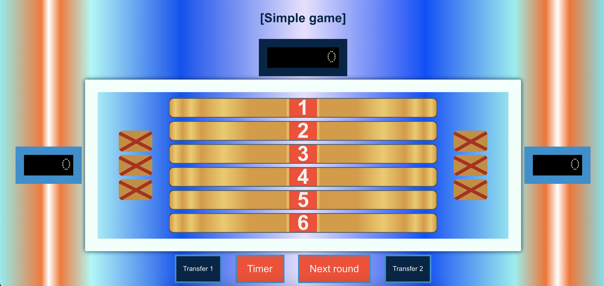

# Family Feud (Russian edition 100 к 1)

## Simple game
All answers are written in json. When you open the card, points are added to the bank. Accrue all points from the bank to the winning team.

## Reverse game
Accrue points for an open card directly to the team bank.

## Big game
Start the timer. Response time is 20 seconds. Record the player's answers in the left column. Manually add the number of matching answers.
Hide the answers. Record player 2's answers in the right column.
The sum of all matches from both columns will go to the bank.
The team won if it scored more than 200 points.

## Other variants
You can add double and triple game based on simple game.

## Sounds from original tv-show
- right answer
- error
- error for Big Game
- timer

In the project directory, you can run:

### `yarn install`
### `yarn start`

Runs the app in the development mode.\
Open [http://localhost:3000](http://localhost:3000) to view it in the browser.
